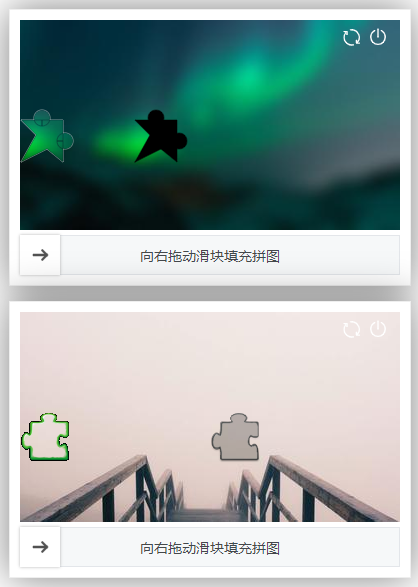

# javascript canvas图片滑块验证

## 载入资源
```html
<link href="./image-slider-validation.css" rel=stylesheet>
<script src="./image-slider-validation.js"></script>
```

## 使用方法
```javascript
// 提供 show, close, reLoad 方法
var oISV = ImageSliderValidation({
  // canvas： 后端给出镂空的坐标（x,y）, 由前端绘制图片并验证
  // image： 由后端生成两张图片，前端不知道坐标（x,y）
  mode: 'canvas',
  
  // 装载容器
  wrapper: oDemoButton,

  // 图片宽度
  width: 380, 

  // 图片高度
  height: 210,

  // 滑块宽度
  sliderButtonWidth: 40,

  // 验证成功回调
  success: function (x, y, fnClosePlugin) { },

  // 验证失败回调
  error: function (fnClosePlugin) { },

  // 获取图片的回调，这里可以调用自己的接口，callback数据参照此例子
  onGetImage (callback) {
    var imgWidth = getRandom(380, 500)
    var imgHeight = Math.round(imgWidth * 210 / 380)
    var imgUrl = `https://picsum.photos/${imgWidth}/${imgHeight}/?blur=10`
    callback({
      src: imgUrl,
      x: getRandom(100, 320), // 镂空坐标X 0~248
      y: getRandom(0, 150), // 镂空坐标Y 0~112
    })
  },

  // 鼠标抬起验证，这个用于坐标由后端生成，向后端进行验证
  onMouseUp: function (currentX, success, fail) { }
})

oISV.show() // 显示插件
oISV.close() // 隐藏插件
oISV.reLoad() // 重新加载验证图片
```

